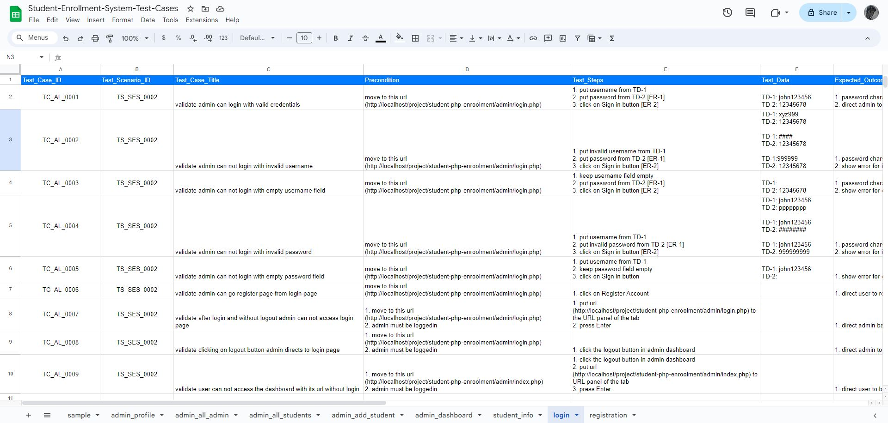
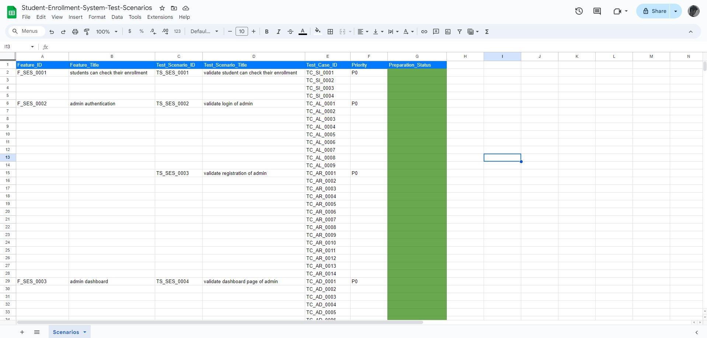
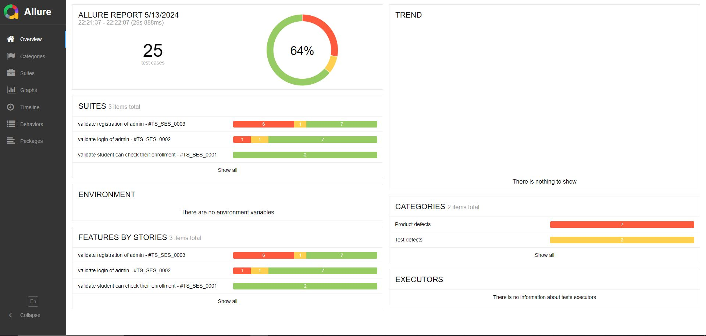
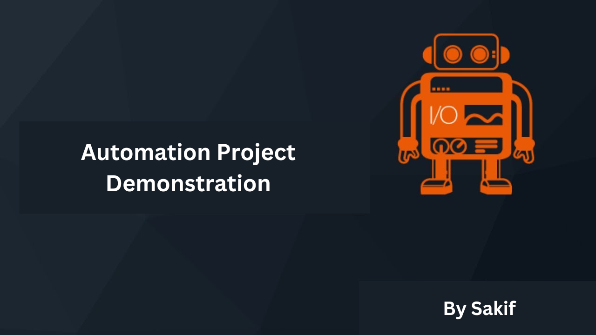

# Web Automation Testing with WebdriverIO
A simple dummy website named [Studnet Enrollment System](https://code-projects.org/student-enrollment-in-php-with-source-code/) is taken for testing purposes. This application is mainly tested from a functional testing perspective. The UI of this web is automated to verify its functions. For the automation testing, the following processes are taken,
1. Firstly, the application went through the exploratory test.
2. Every feature was noted down.
3. The features were broken down into test scenarios.
4. With those test scenarios, test cases were prepared.
5. Once the documents got prepared, a manual test is performed on the application.
6. After that, the test execution report was completed.
7. Finally the test cases were converted into the javascript code in WebdriverIO framework.

## Note: 
* Test documents are stored in test_documents folder.
* This automation test uses the fundamental features and concepts of Javascript UI Automation Framework WebdriverIO.
* This reposity is still in updating process.
* Only Chrome browser is used for executing  this test.
* Allure report is generated and added to this repo.

## Here are some views of test documents,
* Test Cases View
  

* Test Scenarios View
  
  
* Allure report overview
  

* Sample Automated test on registration page of the application
   
